This is an [R Markdown](http://rmarkdown.rstudio.com) Notebook. When you execute code within the notebook, the results appear beneath the code. 

Try executing this chunk by clicking the *Run* button within the chunk or by placing your cursor inside it and pressing *Cmd+Shift+Enter*. 

```{r warning=FALSE, message=FALSE, results=FALSE}
# install.packages("testthat")
# install.packages("devtools")
# install.packages("dplyr")
# install.packages("ICC")
# install.packages("MetaUtility")
# install.packages("ggplot2")
library(testthat)
library(EValue)
library(devtools)
library(dplyr)
library(ICC)
library(MetaUtility)
library(ggplot2)
library(boot)
library(here)
```

### Below tests run on 11/19/20 with github code pull on 11/19/20:
```{r}
# make file paths relative so they run on other machines
setwd(here())
source("helper_testthat.R")

# setwd("~/Box Sync/jlee/Maya/metasens_website/Main site/tests_human_inspection")
# source("helper_testthat.R")


# source("~/Box Sync/jlee/Maya/evalue/EValue/tests/helper_testthat.R")
# source("~/Box Sync/jlee/Maya/evalue/EValue/R/meta-analysis.R")
# setwd("~/Box Sync/jlee/Maya/evalue/tests_human_inspection/")
```

#### test1 gbc_prepped.csv file
```{r  error=TRUE}

# @@MM fix R output

d = read.csv("Datasets for website test/gbc_prepped.csv")

confounded_meta(method="calibrated",
                q = log(.9),
                r = 0.1,
                muB = 0,
                tail = "below",
                yi.name = "yi",
                vi.name = "vi",
                dat = d,
                R = 500)
### R output:
# The confidence interval and/or standard error for the proportion were not estimable via bias-corrected and accelerated bootstrapping. You can try increasing R.
# [1] "All values of t are equal to  1 \n Cannot calculate confidence intervals"
# Error in data.frame(lo.T, hi.T, SE.T, lo.G, hi.G, SE.G) : 
#   arguments imply differing number of rows: 1, 0

### Website output: 
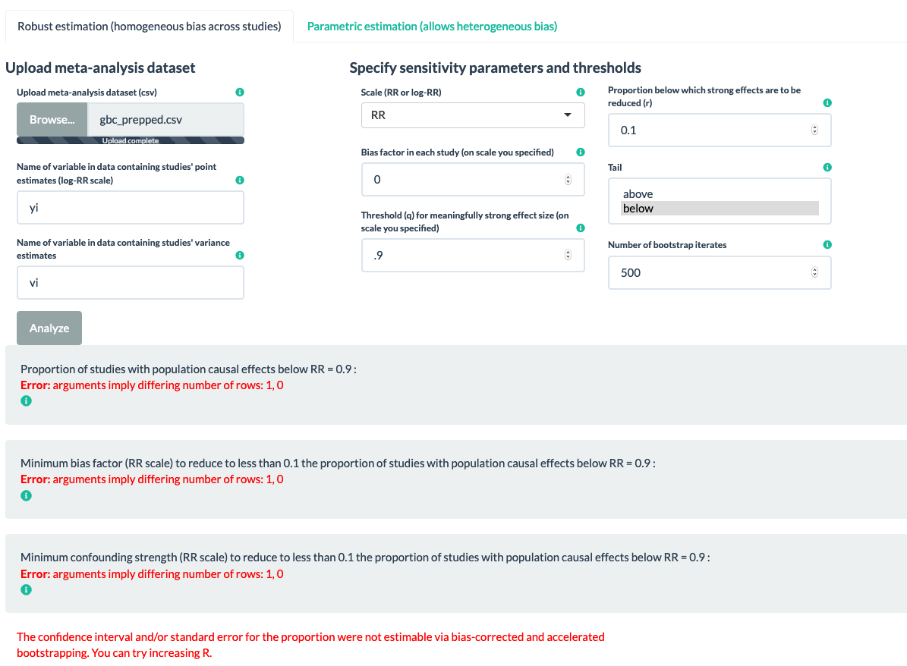


sens_plot(method="calibrated",
          type = "line",
          q = log(0.9),
          tail = "below",
          Bmin = log(1),
          Bmax = log(4),
          yi.name = "yi",
          vi.name = "vi",
          dat = d,
          R = 500)

### R output:
# Some of the pointwise confidence intervals were not estimable via bias-corrected and accelerated bootstrapping, so the confidence band on the plot may not be shown for some values of the bias factor. This usually happens at values with a proportion estimate close to 0 or 1. Otherwise, you can try increasing R.
# Warning messages:
# 1: Problem with `mutate()` input `..1`.
# ℹ extreme order statistics used as endpoints
# ℹ Input `..1` is `...[]`.
# ℹ The error occurred in row 28. 
# 2: In norm.inter(t, adj.alpha) :
#   extreme order statistics used as endpoints
# 3: Problem with `mutate()` input `..1`.
# ℹ extreme order statistics used as endpoints
# ℹ Input `..1` is `...[]`.
# ℹ The error occurred in row 35. 
# 4: In norm.inter(t, adj.alpha) :
#   extreme order statistics used as endpoints
# 5: Problem with `mutate()` input `..1`.
# ℹ extreme order statistics used as endpoints
# ℹ Input `..1` is `...[]`.
# ℹ The error occurred in row 36. 
# 6: In norm.inter(t, adj.alpha) :
#   extreme order statistics used as endpoints

### Website output: 

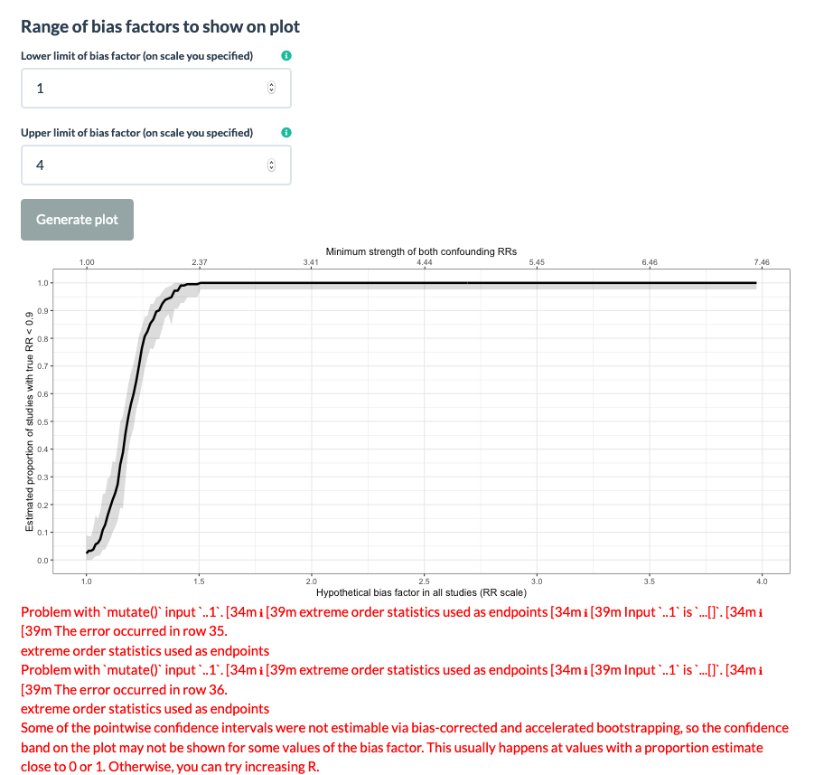
```

#### test2 gbc_prepped.csv file
```{r  error=TRUE}

# MM: This test was set up incorrectly. confounded_meta always accepts input on log scale,
#  so you were muB = 0.5 on LOG scale to confounded_meta but muB = exp(0.5)
#  to the website.
#  Accordingly, the Shiny code wasn't handling log vs. RR correctly. I fixed it. 
#  I fixed the website screenshots to show passing input on both log and RR scales.
#  Please update the line plot. 

d = read.csv("Datasets for website test/gbc_prepped.csv")

confounded_meta(method="calibrated",
                q = log(0.5),
                r = 0.5,
                muB = 0.5,
                tail = "above",
                yi.name = "yi",
                vi.name = "vi",
                dat = d,
                R = 500)
### R output:
# The confidence interval and/or standard error for the proportion were not estimable via bias-corrected and accelerated bootstrapping. You can try increasing R.
#   Value      Est         SE    CI.lo    CI.hi
# 1  Prop 1.000000         NA       NA       NA
# 2  Tmin 2.133700 0.02639639 2.086307 2.193844
# 3  Gmin 3.689005 0.05413210 3.591753 3.812209


### Website output (passing on log scale): 
knitr::include_graphics("test2_2a_log.png")

### Website output (passing on RR scale): 
knitr::include_graphics("test2_2a_rr.png")

# MM: JL, update this:
sens_plot(method="calibrated",
          type = "line",
          q = log(.5),
          tail = "above",
          Bmin = log(1),
          Bmax = log(6),
          yi.name = "yi",
          vi.name = "vi",
          dat = d,
          R = 500)

### R output:
# Some of the pointwise confidence intervals were not estimable via bias-corrected and accelerated bootstrapping, so the confidence band on the plot may not be shown for some values of the bias factor. This usually happens at values with a proportion estimate close to 0 or 1. Otherwise, you can try increasing R.
# Warning messages:
# 1: In norm.inter(t, adj.alpha) :
#   extreme order statistics used as endpoints
# 2: In norm.inter(t, adj.alpha) :
#   extreme order statistics used as endpoints
# 3: In norm.inter(t, adj.alpha) :
#   extreme order statistics used as endpoints
# 4: In norm.inter(t, adj.alpha) :
#   extreme order statistics used as endpoints

### Website output: 
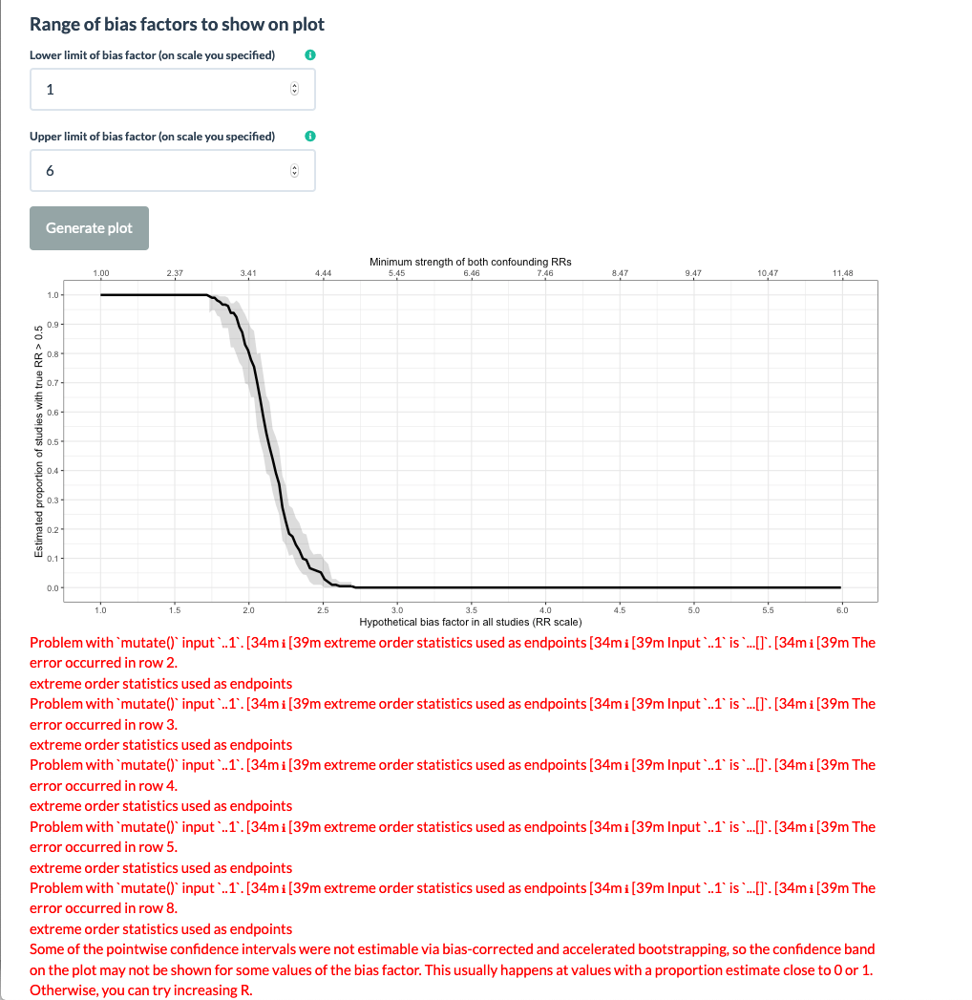
```

#### test3 gbc_prepped.csv file
```{r error=TRUE}
d = read.csv("Datasets for website test/gbc_prepped.csv")

## get error for column name
confounded_meta(method="calibrated",
                q = log(.5),
                r = 0.5,
                muB = 0.5,
                tail = "above",
                yi.name = "yi",
                vi.name = "vyi",
                dat = d,
                R = 2000)
### R output:
 # Error in Phat_causal(q = q, B = muB, tail = tail, dat = dat, yi.name = yi.name,  : 
 #  dat does not contain a column named vi.name 

### Website output: 
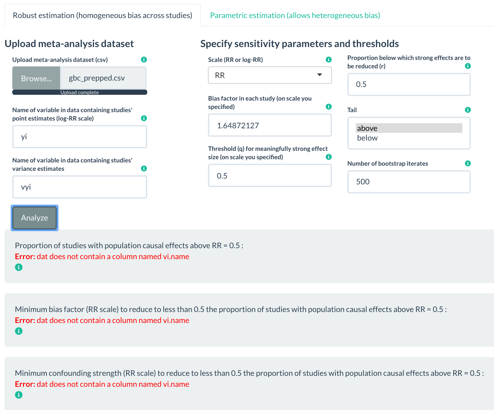
```

#### test4 flegal_prepped.csv file
```{r error=TRUE}
d = read.csv("Datasets for website test/flegal_prepped.csv")

## on log-RR scale:
# log(.5)
confounded_meta(method= "calibrated",
                q = -0.6931472,
                r = 0.5,
                muB = 0.5,
                tail = "above",
                yi.name = "yi",
                vi.name = "vi",
                dat = d,
                R = 500)
### R output:
# The confidence interval and/or standard error for the proportion were not estimable via bias-corrected and accelerated bootstrapping. You can try increasing R.
#   Value      Est         SE    CI.lo    CI.hi
# 1  Prop 1.000000         NA       NA       NA
# 2  Tmin 1.834157 0.02938043 1.792858 1.911209
# 3  Gmin 3.071078 0.06101954 2.985118 3.230871

### Website output: 
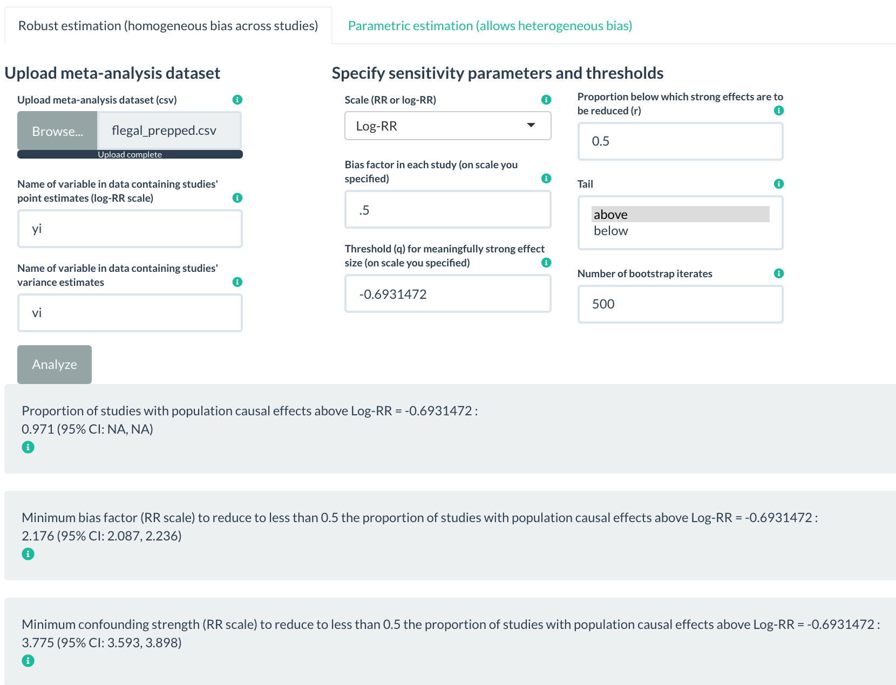

sens_plot(method= "calibrated",
          type = "line",
          q = -0.6931472,
          tail = "above",
          Bmin = 1,
          Bmax = 4,
          yi.name = "yi",
          vi.name = "vi",
          dat = d,
          R = 500)

### R output:
# [1] "All values of t are equal to  1 \n Cannot calculate confidence intervals"
# None of the pointwise confidence intervals were not estimable via bias-corrected and accelerated bootstrapping, so the confidence band on the plot is omitted. You can try increasing R.

### Website output: 
knitr::include_graphics("")
#bm
```

#### test5 flegal_prepped.csv file
```{r error=TRUE}
d = read.csv("Datasets for website test/flegal_prepped.csv")

## extreme R?
confounded_meta(method="calibrated",
                q = log(.5),
                r = 0.1,
                muB = .5,
                tail = "above",
                yi.name = "yi",
                vi.name = "vi",
                dat = d,
                R = 10000)
### R output:
# The confidence interval and/or standard error for the proportion were not estimable via bias-corrected and accelerated bootstrapping. You can try increasing R.
#   Value      Est         SE    CI.lo    CI.hi
# 1  Prop 1.000000         NA       NA       NA
# 2  Tmin 2.177725 0.08646707 2.066321 2.353844
# 3  Gmin 3.779212 0.17689797 3.550693 4.138987

### Website output: 
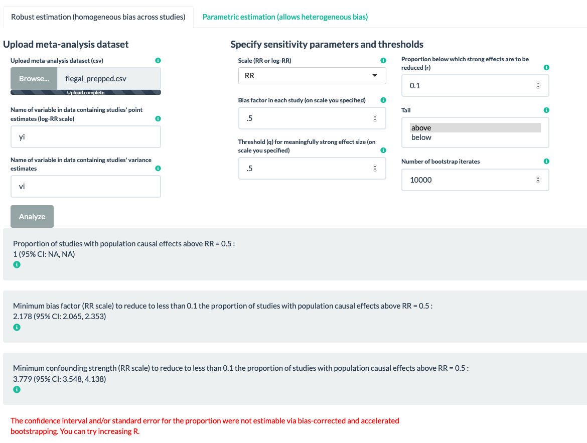
```

#### test6 flegal_prepped.csv file
```{r error=TRUE}
d = read.csv("Datasets for website test/flegal_prepped.csv")

confounded_meta(method="calibrated",
                q = log(1.2),
                r = 1.0,
                muB = 0,
                tail = "above",
                yi.name = "yi",
                vi.name = "vi",
                dat = d,
                R = 500)
### R output:
# The confidence interval and/or standard error for the proportion were not estimable via bias-corrected and accelerated bootstrapping. You can try increasing R.
# [1] "All values of t are equal to  1 \n Cannot calculate confidence intervals"
# Error in data.frame(lo.T, hi.T, SE.T, lo.G, hi.G, SE.G) : 
#   arguments imply differing number of rows: 1, 0

### Website output: 
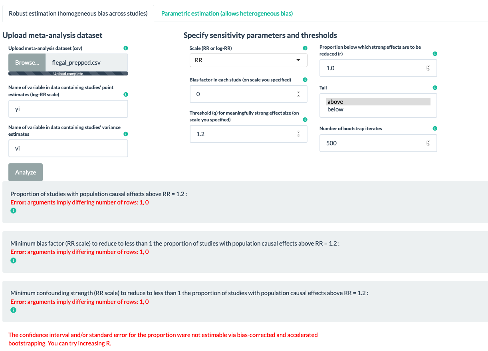
```

#### test7 data_calib_test_1-1.csv file
```{r error=TRUE}
d = read.csv("Datasets for website test/data_calib_test_1-1.csv")

## all 0
confounded_meta(method="calibrated",
                q = log(0),
                r = 0,
                muB = 0,
                tail = "above",
                yi.name = "yi",
                vi.name = "vi",
                dat = d,
                R = 0)
### R output:
# The confidence interval and/or standard error for the proportion were not estimable via bias-corrected and accelerated bootstrapping. You can try increasing R.
# [1] "All values of t are equal to  NaN \n Cannot calculate confidence intervals"
# The confidence interval and/or standard error for Tmin and Gmin were not estimable via bias-corrected and accelerated bootstrapping. You can try increasing R.
#   Value Est SE CI.lo CI.hi
# 1  Prop   1 NA    NA    NA
# 2  Tmin Inf NA    NA    NA
# 3  Gmin NaN NA    NA    NA

### Website output: 
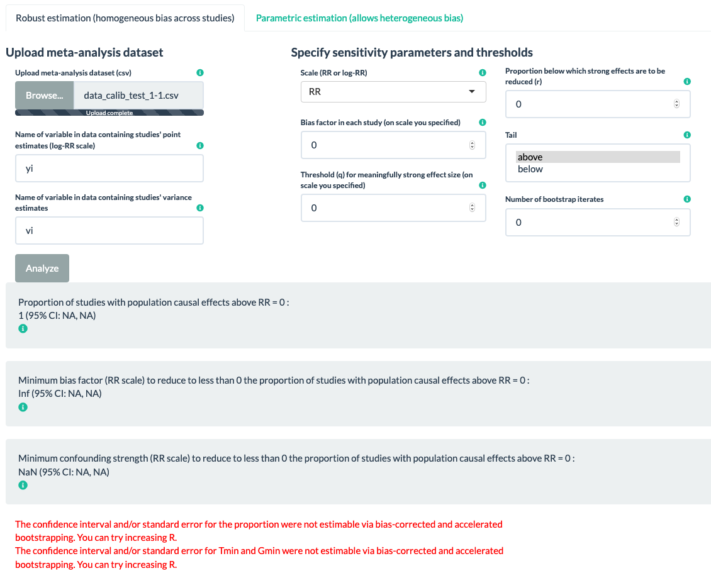


sens_plot(method="calibrated",
          type = "line",
          q = log(0),
          tail = "above",
          Bmin = log(0),
          Bmax = log(0),
          yi.name = "yi",
          vi.name = "vi",
          dat = d,
          R = 0)

### R output:
 # Error in seq.default(Bmin, Bmax, 0.01) : 'from' must be a finite number 

### Website output: 

```

#### test8
```{r error=TRUE}

# @@MM: put in error for muB<0

d = read.csv("Datasets for website test/data_calib_test_1-1.csv")

## parametric method test
confounded_meta(method="parametric",
                q=log(1.1),
                r=0.2,
                tail="above",
                muB=log(1.2),
                sigB=sqrt(0.35*0.1),
                yr=log(1.2),
                vyr=0.01,
                t2=0.1,
                vt2=0.01)
### R output:
#   Value       Est        SE    CI.lo     CI.hi
# 1  Prop 0.3542627 0.1809323 0.000000 0.7088834
# 2  Tmin 1.4235523 0.2369612 1.000000 1.8879878
# 3  Gmin 2.2000501 0.5187985 1.183224 3.2168766

### Website output: 
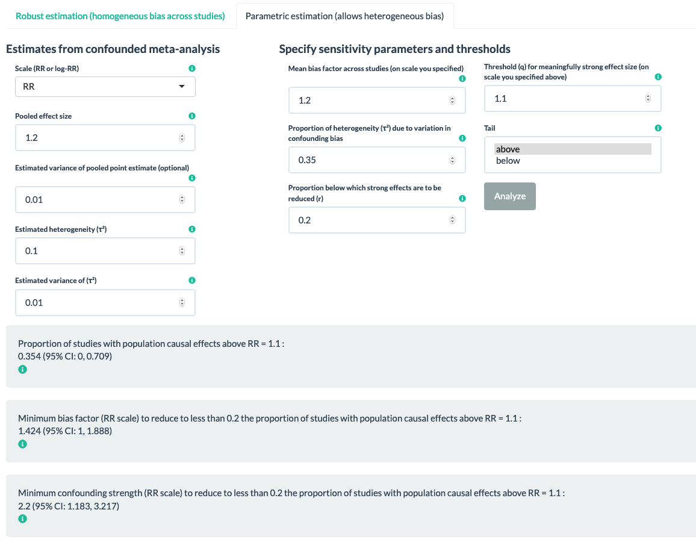

sens_plot(method = "parametric",
          type="line",
          q=log(1.1),
          yr=log(1.2),
          vyr=0.01,
          t2=0.1,
          vt2=0.01,
          Bmin=log(1),
          Bmax=log(4),
          sigB=sqrt(0.35*0.1),
          tail="above" )

### R output:
# Warning message:
# In sens_plot(method = "parametric", type = "line", q = log(1.1),  :
#   Calculating parametric confidence intervals in the plot. For values of Phat that are less than 0.15 or greater than 0.85, these confidence intervals may not perform well.

### Website output: 
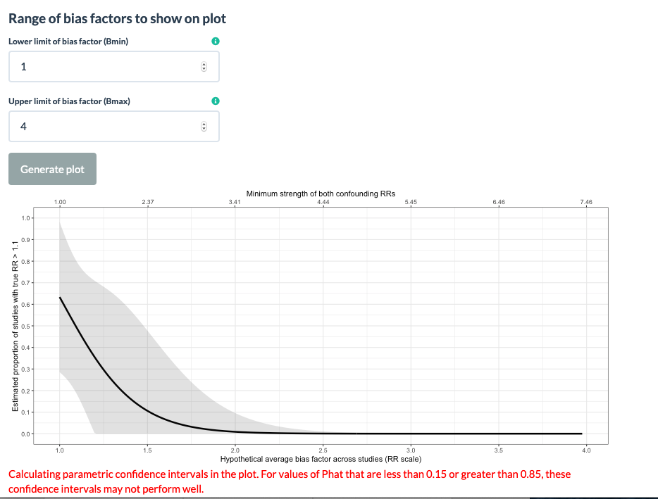
```

#### test9 
```{r error=TRUE}
## parametric method test
## see what errors if all 0
confounded_meta(method="parametric",
                q=log(0),
                r=0,
                tail="above",
                muB=log(0),
                sigB=0,
                yr=log(0),
                vyr=0,
                t2=0,
                vt2=0)
### R output:
# Error in confounded_meta(method = "parametric", q = log(0), r = 0, tail = "above",  : 
#   Must have t2 > sigB^2

### Website output: 
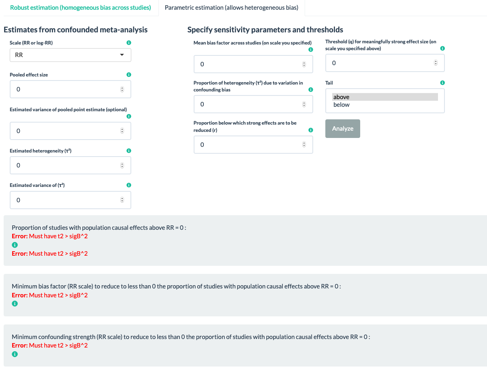
```


#### test10 
```{r error=TRUE}
## parametric method test
confounded_meta(method="parametric",
                q=log(.5),
                r=0.75,
                tail="below",
                muB=log(1.5),
                sigB=sqrt(0.5*0.25),
                yr=log(1.5),
                vyr=0.5,
                t2=0.25,
                vt2=0.5)
### R output:
#   Value        Est        SE CI.lo     CI.hi
# 1  Prop 0.02496774 0.3441508     0 0.6994909
# 2  Tmin 0.23791135 1.8262687     1 3.8173322
# 3  Gmin        NaN       NaN   NaN       NaN
# Warning messages:
# 1: In confounded_meta(method = "parametric", q = log(0.5), r = 0.75,  :
#   Prop is close to 0 or 1. We recommend choosing method = "calibrated" or alternatively using bias-corrected and accelerated bootstrapping to estimate all inference in this case.
# 2: In sqrt(Tmin^2 - Tmin) : NaNs produced

### Website output: 
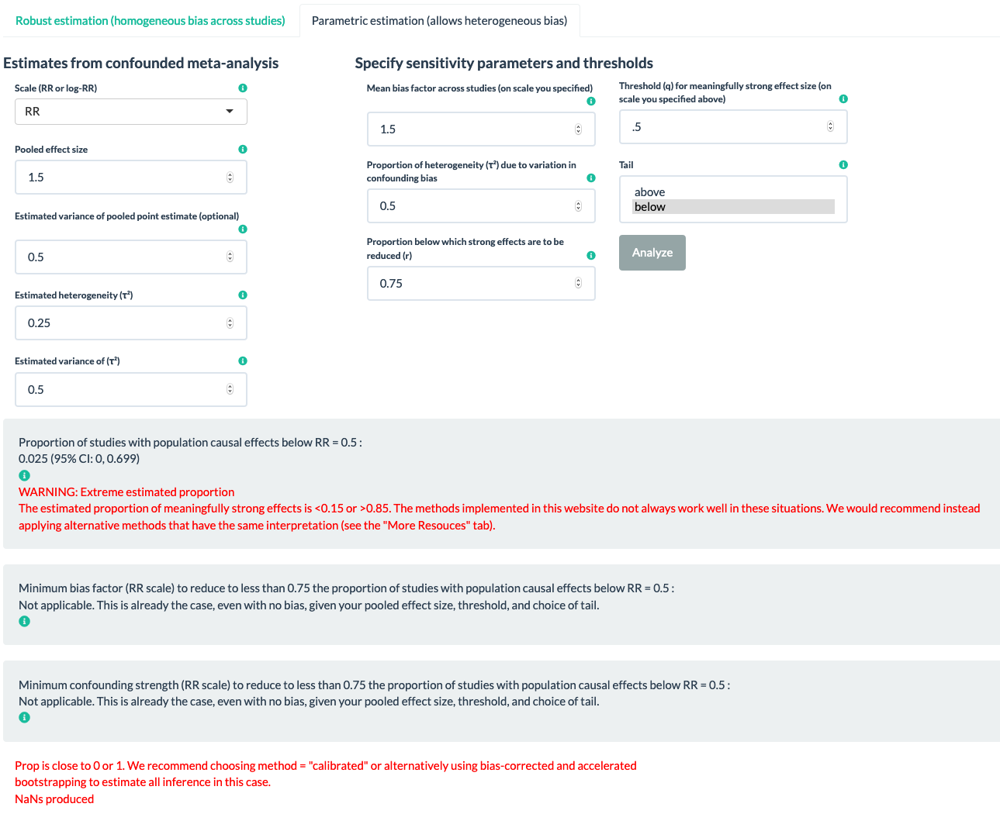


sens_plot(method = "parametric",
          type="line",
          q=log(.5),
          yr=log(1.5),
          vyr=0.5,
          t2=0.25,
          vt2=sqrt(0.5*(0.25)),
          Bmin=log(1),
          Bmax=log(4),
          sigB=sqrt(0.5*0.25),
          tail="below" )

### R output:
# Warning message:
# In sens_plot(method = "parametric", type = "line", q = log(0.5),  :
#   Calculating parametric confidence intervals in the plot. For values of Phat that are less than 0.15 or greater than 0.85, these confidence intervals may not perform well.

### Website output: 
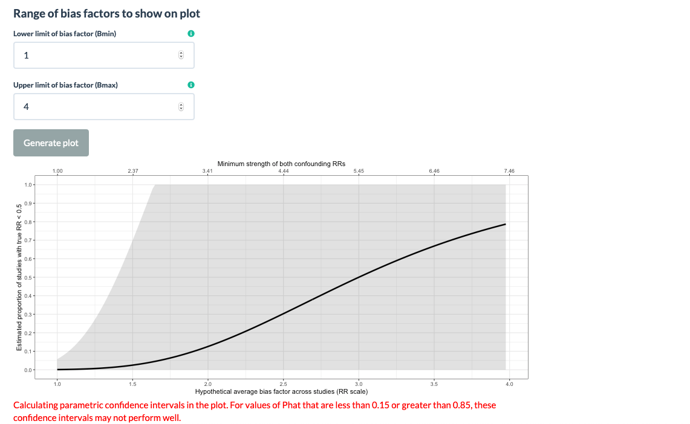
```


#### test11 
```{r error=TRUE}
## on log-RR scale
# log(1.2)
## parametric method test
confounded_meta(method="parametric",
                q=0.1823216,
                r=0.2,
                tail="below",
                muB=.2,
                sigB=sqrt(0.15*0.25),
                yr=.4,
                vyr=0.05,
                t2=0.25,
                vt2=0.05)
### R output:
#   Value       Est        SE     CI.lo     CI.hi
# 1  Prop 0.4847044 0.1935404 0.1053722 0.8640366
# 2  Tmin 1.2252345 0.5534300 1.0000000 2.3099373
# 3  Gmin 1.7505582 1.3174664 1.0000000 4.3327449

### Website output: 
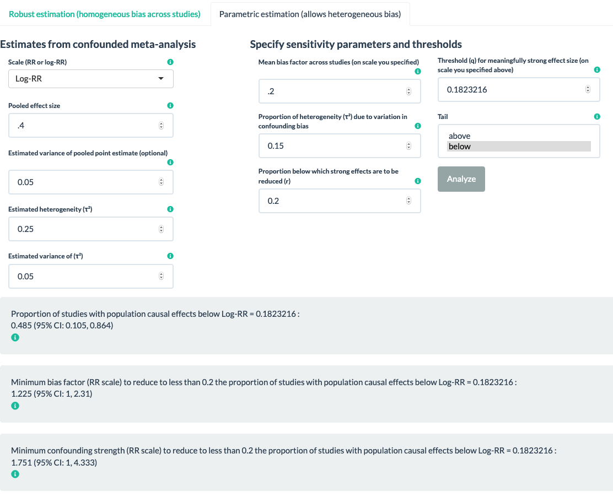


sens_plot(method = "parametric",
          type="line",
          q=0.1823216,
          yr=.4,
          vyr=0.05,
          t2=0.25,
          vt2=0.05,
          Bmin=1,
          Bmax=6,
          sigB=sqrt(0.15*0.25),
          tail="below" )

### R output:
# Warning message:
# In sens_plot(method = "parametric", type = "line", q = 0.1823216,  :
#   Calculating parametric confidence intervals in the plot. For values of Phat that are less than 0.15 or greater than 0.85, these confidence intervals may not perform well.

### Website output: 
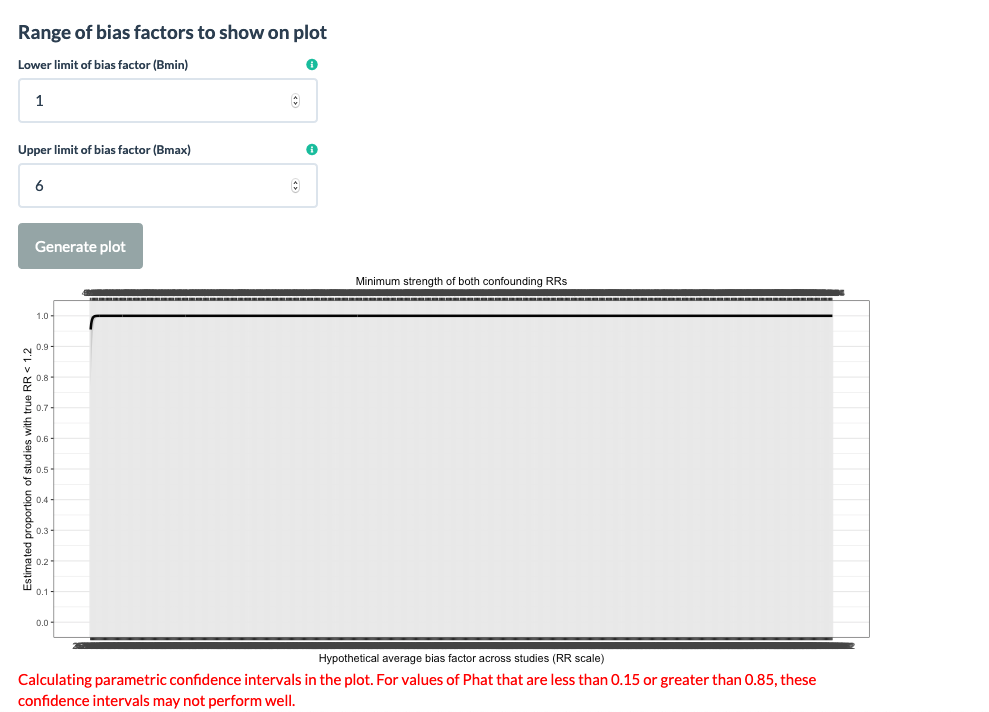
```


#### test12 kodama_prepped.csv
```{r error=TRUE}
# MM did this one
d = read.csv("Datasets for website test/kodama_prepped.csv")

confounded_meta(method="calibrated",
                q=log(1.5),
                r=0.3,
                tail="below",
                muB=log(1.5),
                
                dat = d, 
                yi.name = "yi",
                vi.name = "vi")
### R output:
# The confidence interval and/or standard error for the proportion were not estimable via bias-corrected and accelerated bootstrapping. You can try increasing R.
#   Value      Est        SE CI.lo    CI.hi
# 1  Prop 0.937500        NA    NA       NA
# 2  Tmin 1.003351 0.0258029     1 1.131446
# 3  Gmin 1.061336 0.1212162     1 1.517092


```


